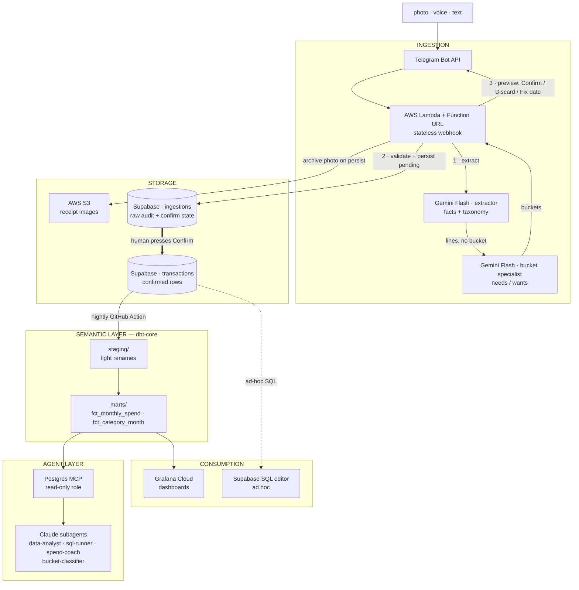

# Architecture

## System overview



Text and receipt photos share the same confirm loop. Photos download from
Telegram, extract with Gemini vision, then archive to S3 only when the
ingestion is persisted. Voice notes and category/amount Edit remain later
in Phase 3.

`docs/SEMANTIC_LAYER.md` is the metric contract for the marts layer: both the
dbt models and the agent read it, so numbers agree everywhere.

## Component choices and rationale

### Ingestion — Telegram Bot + AWS Lambda
- Telegram Bot API is free, has first-class photo/voice/file APIs, and inline
  keyboards for the confirm loop.
- **Lambda + Function URL** (TypeScript, Node runtime). A Function URL gives a
  valid HTTPS endpoint on port 443 — exactly what Telegram's `setWebhook`
  requires — with no API Gateway in front, so no API Gateway bill.
- Lambda's free tier is **perpetual**, not 12-month: 1M requests and 400k
  GB-seconds per month, against a workload of ~150 invocations. Ingestion
  compute is $0 indefinitely, not $0 until a trial expires.
- The handler is intentionally thin: authenticate → extract (two Gemini
  specialists) → validate → persist pending → reply. Photos download
  media first; S3 archive happens only on persist (UUID, then PutObject,
  then INSERT). All state lives in Postgres, so it stays stateless.
- Idempotency: `ingestions.telegram_update_id` is UNIQUE; Telegram retries
  webhooks, and the unique constraint makes retries harmless.
- Secrets (Telegram bot token, webhook secret token, chat-ID allowlist, Gemini
  key, Supabase connection string) live in **SSM Parameter Store** as
  `SecureString`, read at cold start. Parameter Store's standard tier is free;
  Secrets Manager would be ~$0.40/secret/month for no benefit here.
- Connect to Supabase through the **transaction pooler** (port 6543), not a
  direct connection — Lambda concurrency and per-connection Postgres do not mix.
  Irrelevant at 5 messages/day, correct by default.
- Region: `ca-central-1` (Montreal) — lowest latency to the owner and keeps
  personal financial data in Canada. Marginally pricier than `us-east-1` on S3
  ($0.025 vs $0.023/GB); immaterial at this volume.

### Extraction — Gemini Flash (free tier)
- Handles images (receipts) and audio (voice notes) natively — one API for all
  three input types. Free-tier quota comfortably covers personal volume
  (a handful of requests/day). Model pinned: `gemini-3.6-flash`.
- Two sequential structured-output calls in the Lambda, not one prompt:
  **extractor** (facts + taxonomy, including `item_type`) then **bucket
  specialist** (personal rules from SSM). Item type is not a third call.
- Extractor prompt includes the live taxonomy (fetched from Postgres, contract
  in docs/TAXONOMY.md). Output matches the `extraction` schema in
  DATA_MODEL.md. Line amounts (tax allocated proportionally) must sum to the
  header; that check is **code** (integer cents), not another model.
- The bot replies with the full proposed ledger row plus check results.
  Confirm / Discard / Fix date appear when checks pass. Text with no date
  defaults to today and warns. Photos with no printed/caption date persist
  without Confirm. Category/amount Edit is later. Voice is later.

### Storage — Supabase Postgres (rows) + AWS S3 (images)

Storage is deliberately split. Postgres and object storage have different
constraints here, and the free tiers that fit them are on different clouds.

**Supabase Postgres** — the system of record.
- Free tier: 500 MB database + 5 GB egress/month. Verify against Supabase's
  pricing page before relying on these — free-tier limits move.
- Headroom: a Telegram update's `raw_payload` is ~1–3 KB, so `ingestions`
  grows a handful of MB per year against 500 MB. Transactions themselves are
  rounding error. This does not become a problem within the project's lifetime.
- Kept over RDS/Aurora because there is no durable free Postgres on AWS — see
  the costed comparison in DECISIONS.md 2026-08-10. Studio's SQL editor also
  doubles as the ad-hoc query console.
- Note: free projects pause after ~1 week of inactivity; daily logging keeps it
  warm, and the nightly dbt Action acts as a heartbeat.

**AWS S3** — receipt images, key stored in `ingestions.media_path`.
- ~$0.023–0.025/GB-month with no cap, versus Supabase Storage's 1 GB ceiling.
  At ~150 KB per Telegram-compressed photo, a few years of receipts is ~$0.05
  per month. The image-retention question disappears rather than being deferred.
- Bucket is private with Block Public Access on, SSE-S3 (AES256), and a
  TLS-only deny. The ingest role may `s3:PutObject` only. Vision uses
  Telegram file bytes, so `GetObject` is still unused. Any future UI would
  use presigned URLs.
- Lifecycle rule transitions objects to Glacier Instant Retrieval after 1 year
  — receipts are written once and essentially never read again.

### Schema

The full DDL lives in **[DATA_MODEL.md](DATA_MODEL.md)** — that file is the
schema contract and must stay in sync with `supabase/migrations/`. The
rationale for its shape:

- Notion's "Financial Future" rows become `type = 'transfer'` with a
  `to_account_id` — savings are not expenses.
- Transactions are headers; classification (subcategory, item type, and the
  needs/wants `bucket`) lives on `transaction_items` lines, because one
  receipt can span categories and the same subcategory can be a need or a
  want depending on the line. Subcategories keep a `default_bucket` only as
  an extraction hint.
- Money is `numeric`, never `float`.
- `ingestions` separates "what arrived" from "what I confirmed" — auditability,
  reprocessing (better prompts later can re-run old receipts), and a natural
  place for the confirm/edit state machine.

### Semantic layer — dbt-core + SEMANTIC_LAYER.md
- dbt project in `dbt/`: `staging/` (light renames from raw tables) →
  `marts/` (fct_monthly_spend, fct_category_month, dim views).
- Canonical metric definitions in `docs/SEMANTIC_LAYER.md`, e.g.
  **discretionary spend** = expenses with funding source 'self' AND
  subcategory ≠ Rent; **savings rate** = transfers / income per month. Both dbt models
  and the agent reference this file so numbers agree everywhere.
- Runs free on GitHub Actions nightly cron (public repo = unlimited minutes).

### Consumption — Grafana Cloud + Supabase Studio
- Grafana Cloud free tier connects straight to Supabase Postgres; rebuild the
  Notion views first: cumulative monthly spend (ex-rent, ex-externally-funded),
  fixed-expenses donut, most-expensive-wants bar, per-day spend line.
- Ad-hoc SQL: Supabase Studio editor.
- Optional later: Evidence.dev static site (built by Actions, hosted on
  S3 + CloudFront) for a shareable, versioned report layer.

### Agent layer — Claude Code in this repo
- `.mcp.json` configures a Postgres MCP server (read-only role pointed at
  Supabase) so Claude can query the warehouse directly.
- `.claude/agents/` defines subagents:
  - `data-analyst` — answers questions, produces charts/tables from marts
  - `sql-runner` — translates NL → SQL against the semantic layer, read-only
  - `spend-coach` — monthly reviews: anomalies, category drift, savings rate
  - `bucket-classifier` — same rules as ingest, for backfill / explain /
    owner-requested reclassify only; not the Telegram hot path
- `AGENTS.md` (imported by `CLAUDE.md`) indexes STATUS, DECISIONS, DATA_MODEL
  and SEMANTIC_LAYER, so any session rebuilds full context from a fresh clone.
  Marginal cost: $0 (existing Claude plan).

### Infrastructure as code — Terraform (`infra/`)
- Providers: `aws` (Lambda, Function URL, IAM role + policies, S3 bucket +
  lifecycle + Block Public Access, SSM parameters, CloudWatch log group,
  Budgets alarm), `supabase` (project, settings — **not** schema; schema lives
  in `supabase/migrations/`), `grafana` (stack, data source, dashboards as code).
- Applied incrementally: each resource is terraformed in the phase where it
  first appears (Supabase in 1, Lambda + S3 + IAM in 2, Grafana in 5).
- State is local and gitignored — Terraform state embeds secrets and this repo
  is public. Secret *values* are written to Parameter Store out of band and
  referenced by ARN; they are never Terraform variables and never in state.
- **A budget alarm is a required resource, not a nice-to-have.** The Supabase
  and Grafana free tiers fail closed — you hit a limit and things stop. AWS
  fails open and bills. The alarm is what replaces that safety property. It
  filters on cost allocation tag `Project=finflow` (matched by provider
  `default_tags`), not the whole account.
- Not terraformable, documented as manual steps in the deploy guide: GitHub
  repo, AWS/Supabase/Grafana accounts, BotFather bot creation, Gemini API key,
  and writing the secret values into Parameter Store.

#### Infrastructure / code boundary

Terraform owns the Lambda **function resource, IAM role, and Function URL**.
It does not own the function's **code**. Deploys push code separately.

This is forced, not stylistic: Terraform state is local and gitignored (it
embeds secrets and the repo is public), so CI has no state to plan against and
cannot run `terraform apply`. Code therefore has to ship by another path.

```hcl
resource "aws_lambda_function" "ingest" {
  function_name = "finflow-ingest"
  role          = aws_iam_role.ingest.arn
  handler       = "index.handler"
  runtime       = "nodejs22.x"          # verify latest supported at build time

  # First apply only: a stub so the resource can exist. Real code arrives
  # via update-function-code. Generated, so no binary is committed.
  filename         = data.archive_file.bootstrap.output_path
  source_code_hash = data.archive_file.bootstrap.output_base64sha256

  lifecycle {
    ignore_changes = [filename, source_code_hash]
  }
}
```

The `ignore_changes` block is the load-bearing line. Without it, the next
`terraform apply` after any deploy sees drift and reverts the function to the
bootstrap stub — a silent production rollback triggered by an unrelated infra
change.

**Deploy path:** GitHub Actions on push to `main` → esbuild bundles TypeScript
to a single `dist/index.js` → zip → `aws lambda update-function-code`. Actions
authenticates via **OIDC** assuming a deploy role whose only permission is
`lambda:UpdateFunctionCode` on this one function. No long-lived AWS access keys
exist anywhere, which matters more than usual on a public repo.

**Consequence to remember:** `terraform destroy && terraform apply` yields a
working function running the *stub*, not the app. Re-running the deploy workflow
is part of any rebuild, and the "deploy your own" guide must say so.

## Security
- Public repo: all credentials in SSM Parameter Store (`SecureString`), GitHub
  Actions secrets, or `.env`. Never in tracked files, never in Terraform state.
- The Lambda handler validates Telegram's `X-Telegram-Bot-Api-Secret-Token`
  header and ignores updates from any chat ID other than the owner's. The
  Function URL is public by necessity (Telegram must reach it), so these two
  checks are the entire authentication boundary — they run before any other work.
- Lambda's IAM role is least-privilege: `s3:PutObject` scoped to the receipts
  bucket prefix, `ssm:GetParameter` scoped to the project's parameter path,
  `kms:Decrypt` for those parameters, and CloudWatch Logs write. No wildcards.
- S3 bucket: Block Public Access enabled, default encryption on, no bucket
  policy granting anything to `*`.
- The MCP database role is read-only (`GRANT SELECT` on marts only).
- AWS billing is a security concern here, not just a cost one: a leaked key on
  a public repo is exploitable for compute. Budget alarm + least-privilege IAM
  + no long-lived access keys in CI (use OIDC if Actions ever needs AWS).
