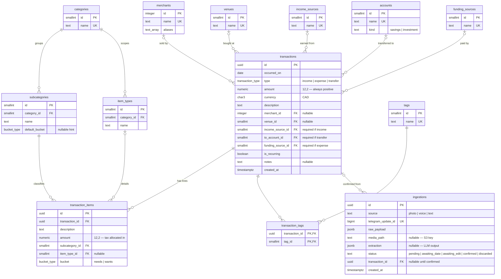

# Data model

The schema contract. `supabase/migrations/` must agree with this file; change
both in the same commit. For *why* the storage layer looks like this, see
[ARCHITECTURE.md](ARCHITECTURE.md); for the classification taxonomy the seed
data implements, see [TAXONOMY.md](TAXONOMY.md); for when each choice was
made, see [DECISIONS.md](DECISIONS.md).

## Shape in one paragraph

Transactions are `income | expense | transfer` **headers**; classification
lives on `transaction_items` **lines**. A three-level taxonomy — 11 categories
→ 54 subcategories → item types where they earn their keep (see
[TAXONOMY.md](TAXONOMY.md)) — classifies each line, along with a per-line
needs/wants `bucket`. Every expense has at least one line; a receipt with
line-item detail has many, and lines from one receipt may belong to different
categories. Merchants, venues, funding sources, income sources, and accounts
are lookup tables; tags stay for free-form *context* only (Travel, Social,
Avoidable…). Every Telegram message lands in `ingestions` before it can
become a confirmed transaction.

## Entity-relationship diagram

The diagram shows entities, keys, and relationship cardinality only. Check
constraints, enum values, and cross-table rules (tax allocation, the
item-type/subcategory category match) are not representable here — the DDL
below and [Invariants](#invariants) remain the authority.



## DDL

```sql
create type transaction_type as enum ('income', 'expense', 'transfer');
create type bucket_type      as enum ('needs', 'wants');

create table categories (
  id   smallint generated always as identity primary key,
  name text not null unique
);

create table subcategories (
  id             smallint generated always as identity primary key,
  category_id    smallint not null references categories(id),
  name           text not null,
  default_bucket bucket_type,      -- extraction hint only; the authoritative
                                   -- bucket is per line item
  unique (category_id, name)
);

-- Third classification level, only for categories where it earns its keep
-- (see TAXONOMY.md). Scoped to a category, not a subcategory: Food & drink
-- item types apply across all its channels.
create table item_types (
  id          smallint generated always as identity primary key,
  category_id smallint not null references categories(id),
  name        text not null,
  unique (category_id, name)
);

create table merchants (
  id      integer generated always as identity primary key,
  name    text not null unique,
  aliases text[] not null default '{}'            -- for LLM normalization
);

-- Venue / channel of purchase (Supermarket, Coffee Shop, Pharmacy, ...).
-- Single-valued per transaction, unlike tags.
create table venues (
  id   smallint generated always as identity primary key,
  name text not null unique
);

create table income_sources (
  id   smallint generated always as identity primary key,
  name text not null unique                       -- values seeded locally
);

create table accounts (
  id   smallint generated always as identity primary key,
  name text not null unique,                      -- values seeded locally
  kind text not null check (kind in ('savings', 'investment'))
);

-- Who paid for an expense. Null on income and transfer. The tracked seed
-- contains only 'self'; additional sources are personal and live in the
-- untracked overlay.
create table funding_sources (
  id   smallint generated always as identity primary key,
  name text not null unique
);

-- Free-form context only (Travel, Social, Avoidable, ...). Venues and
-- merchants are NOT tags.
create table tags (
  id   smallint generated always as identity primary key,
  name text not null unique
);

create table transactions (
  id                uuid primary key default gen_random_uuid(),
  occurred_on       date not null,
  type              transaction_type not null,
  amount            numeric(12,2) not null check (amount > 0),
  currency          char(3) not null default 'CAD',
  description       text not null,
  merchant_id       integer  references merchants(id),
  venue_id          smallint references venues(id),
  income_source_id  smallint references income_sources(id),
  to_account_id     smallint references accounts(id),
  funding_source_id smallint references funding_sources(id),
  is_recurring      boolean not null default false,
  notes             text,
  created_at        timestamptz not null default now(),
  check (type <> 'income'   or income_source_id is not null),
  check (type <> 'transfer' or to_account_id    is not null),
  check (type <> 'expense'  or funding_source_id is not null),
  check (type =  'expense'  or funding_source_id is null)
);
create index on transactions (occurred_on);

-- Receipt line items. Classification lives here, not on the header, because
-- one receipt can span categories and one meal can span item types. A simple
-- quick-log expense gets exactly one line mirroring the header.
create table transaction_items (
  id             uuid primary key default gen_random_uuid(),
  transaction_id uuid not null references transactions(id) on delete cascade,
  description    text not null,
  amount         numeric(12,2) not null check (amount > 0),
  subcategory_id smallint not null references subcategories(id),
  item_type_id   smallint references item_types(id),
  bucket         bucket_type not null
);
create index on transaction_items (transaction_id);
create index on transaction_items (subcategory_id);

create table transaction_tags (
  transaction_id uuid     not null references transactions(id) on delete cascade,
  tag_id         smallint not null references tags(id),
  primary key (transaction_id, tag_id)
);

-- Audit + human-in-the-loop staging. Every Telegram message lands here first.
create table ingestions (
  id                 uuid primary key default gen_random_uuid(),
  source             text not null check (source in ('photo','voice','text')),
  telegram_update_id bigint not null unique,      -- idempotent webhook retries
  raw_payload        jsonb not null,              -- full Telegram update
  media_path         text,                        -- S3 object key
  extraction         jsonb,                       -- LLM structured output
  status             text not null default 'pending'
                     check (status in ('pending','awaiting_date','awaiting_edit','confirmed','discarded')),
  transaction_id     uuid references transactions(id),
  created_at         timestamptz not null default now()
);
```

## Seed data: tracked template + personal overlay

The repo is public and the seed data splits accordingly:

- **Tracked seed migration** — everything generic and fork-ready: categories,
  subcategories (with `default_bucket` hints), item types, venues, context
  tags, and the `'self'` funding source. This is the template a fork starts
  from; [TAXONOMY.md](TAXONOMY.md) is its contract.
- **Untracked personal overlay** — `supabase/seed.personal.sql`, gitignored,
  applied once by hand (`psql -f`). Holds the owner-specific lookup values:
  accounts, income sources, additional funding sources, personal tags, and
  recurring merchants. A tracked `supabase/seed.personal.example.sql` shows
  the format with placeholder values so a fork can build its own overlay.

Nothing in a tracked file may name a personal account, income source,
funding source, tag, or merchant.

## Extraction payload

`ingestions.extraction` holds the LLM's structured output. Item amounts
include proportionally allocated tax, so they always sum to the transaction
amount:

```json
{
  "type": "expense",
  "amount": "27.60",
  "currency": "CAD",
  "date": "2026-08-08",
  "date_source": "stated",
  "description": "McDonald's lunch",
  "merchant": "McDonald's",
  "venue": "Fast Food",
  "tags": ["Social"],
  "funded_by": "self",
  "is_recurring": false,
  "income_source": null,
  "to_account": null,
  "items": [
    { "description": "Burger combo", "amount": "19.55",
      "category": "Food and drink", "subcategory": "Takeout / Quick Service",
      "item_type": "Meals & Prepared Food", "bucket": "wants",
      "bucket_why": "takeout is discretionary" },
    { "description": "Coke", "amount": "8.05",
      "category": "Food and drink", "subcategory": "Takeout / Quick Service",
      "item_type": "Non-Alcoholic Beverages", "bucket": "wants",
      "bucket_why": "soft drink" }
  ],
  "confidence": 0.91,
  "usage": {
    "extractor": { "input": 1200, "output": 180 },
    "bucket": { "input": 800, "output": 40 }
  },
  "meta": {
    "model": "gemini-3.6-flash",
    "extractor_sha256": "…64 hex…",
    "taxonomy_sha256": "…64 hex…",
    "bucket_sha256": "…64 hex…",
    "rules_sha256": "…64 hex…"
  }
}
```

`income_source` is required when `type` is `income`; `to_account` when `type`
is `transfer`. `funded_by` is required when `type` is `expense` and must be
null on income and transfer. Expense lines include `bucket` only after the
bucket specialist runs. Tags are transaction-level, not per line. `date_source`
is `stated` (user, caption, or receipt), `today_default` (text with no date),
`missing` (photo with no date — Confirm omitted), or `fix` (owner typed a
date after Fix date).

Low confidence is stored on the payload for later Edit buttons. Phase 3a
still only offers Confirm / Discard; failed mechanical checks omit Confirm.

`meta` identifies what the model saw: pin name, plus sha256 of the static
extractor instructions (today's calendar date is a placeholder so the hash
does not rotate daily), the live taxonomy blob, the static bucket
instructions, and the rules string actually sent. Bucket/rules hashes are
omitted when the bucket call is skipped (income/transfer). This is not an
accuracy label. A Phase 4 mart can group token cost (and later Edit diffs)
by these hashes. Do not use a manual prompt-version string — it will not
bump when SSM rules change.

## Invariants

- Money is `numeric(12,2)`. Never float.
- A row in `transactions` exists only because a human pressed Confirm on the
  corresponding `ingestions` row.
- Every `expense` transaction has at least one `transaction_items` row, and
  the line amounts sum to `transactions.amount` (tax allocated
  proportionally at extraction). Income and transfer transactions have no
  lines. Enforced by application logic and dbt tests, not triggers.
- `funding_source_id` is set on expenses and null on income and transfer
  (check constraints).
- An item's `item_type_id`, when set, must belong to the same category as
  its `subcategory_id` (dbt test).
- `ingestions.telegram_update_id` is UNIQUE — webhook retries are harmless.
- Migrations are never edited after merge; correct forward with a new one.
